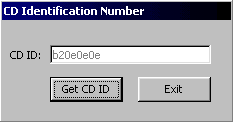



## CD Identification Number

### Description

This little piece of code retrieves a CD's Identification Number. This is very useful, e.g. if you're making a CD Player that needs to get access to the CDDB. I got this code from a friend of mine, and i just remake it because it didn't work properly, and added some comments to it. Hope you like it! : )
 
### More Info
 

             |
---                |---
**Submitted On**   |2000-10-28 02:10:12
**By**             |[Zaxxus](https://github.com/Planet-Source-Code/PSCIndex/blob/master/ByAuthor/zaxxus.md)
**Level**          |Intermediate
**User Rating**    |4.5 (18 globes from 4 users)
**Compatibility**  |VB 5\.0, VB 6\.0
**Category**       |[Sound/MP3](https://github.com/Planet-Source-Code/PSCIndex/blob/master/ByCategory/sound-mp3__1-45.md)
**World**          |[Visual Basic](https://github.com/Planet-Source-Code/PSCIndex/blob/master/ByWorld/visual-basic.md)
**Archive File**   |[CODE\_UPLOAD1100710272000\.zip](https://github.com/Planet-Source-Code/zaxxus-cd-identification-number__1-12341/archive/master.zip)

